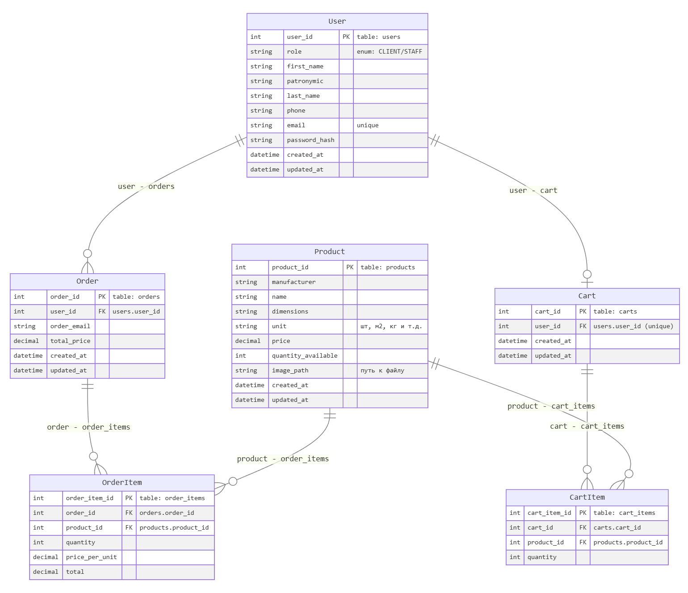
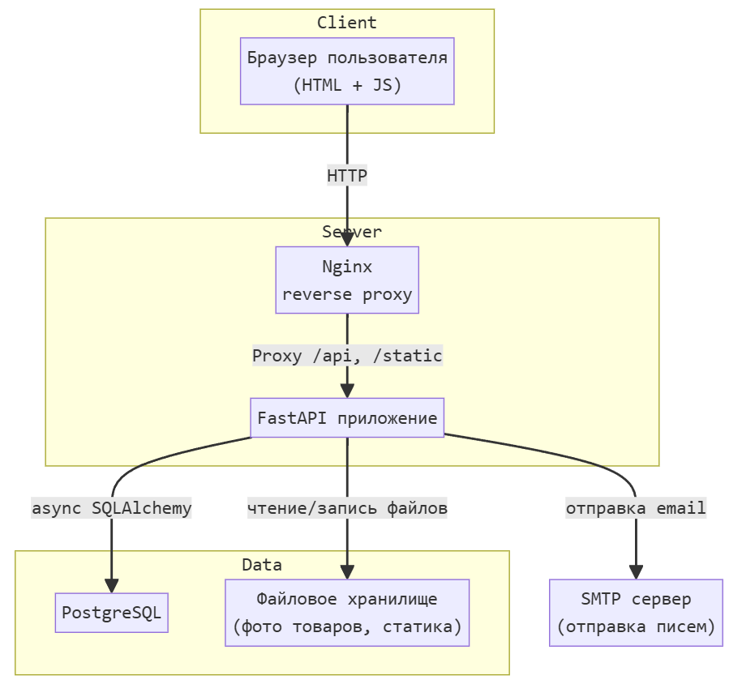
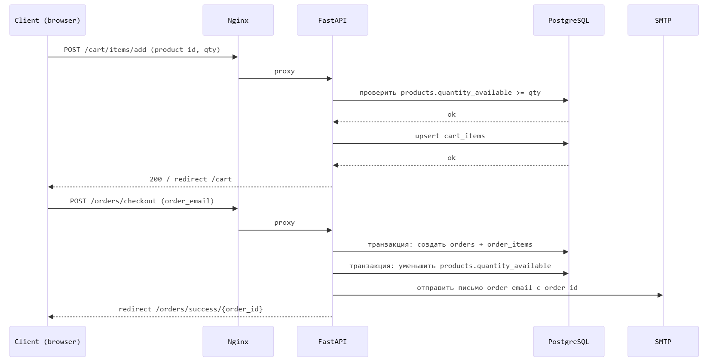

## Project Documentation: Сайт для онлайн-магазина компании, продающей стройматериалы.

## Ссылка на GitHub с разработкой: https://github.com/darya-sheb/OnlineBuildingMaterialsStore

## Разработчики:
1) dev1 - Шебалкова Дарья (darya-sheb)
2) dev2 - Назарова Мария (nazarovamaal-stack)
3) dev3 - Сиротинкина Елизавета (Elizabet0)
4) dev4 - Милешина Мария (glue255)
5) dev5 - Полянская Софья (shannymad)

## Описание проекта

Веб‑приложение интернет‑магазина строительных материалов с авторизацией пользователей двух типов: Клиент (Customer), Работник магазина (Staff)

## Стек технологий:
* Бэкенд: FastAPI (async) + PostgreSQL (SQLAlchemy)
* Фронтенд: HTML + CSS + JS
* Инфраструктура: Docker, Nginx, SMTP, CI/CD

## Клиентский интерфейс:

1) Страница регистрации
    * Форма: имя, отчество, фамилия, телефон, email, пароль, подтверждение пароля.
    * Сообщение об успешной регистрации / ошибках.
2) Страница авторизации
    * Вход по email + пароль.
    * Сообщение об ошибке при неверных данных.
3) Главная / каталог товаров
    * Список товаров: фото, название, производитель, цена, единица измерения, наличие.
    * Кнопка «Добавить в корзину» с выбором количества (проверка остатка).
4) Страница товара (детальная)
   * Фото, характеристики.
   * Выбор количества и добавление в корзину.
5) Корзина
   * Список выбранных товаров, количество, цена по позиции, итоговая сумма.
   * Возможность изменить количество / удалить позицию.
   * Кнопка «Оформить заказ».
6) Оформление заказа
   * Письмо на указанный email с номером заказа.
   * В БД количество товара уменьшается.
7) Личный кабинет клиента
   * Просмотр профиля (имя, фамилия, телефон, email).
8) История заказов на странице "Мои заказы" (список заказов, дата, сумма, детали заказа).

## Интерфейс Работника 
(регистрация, авторизация, просмотр каталога и страниц товара аналогично клиентскому)
1) Панель работника / админ‑секция
    * Отдельный раздел (/staff) с доступом по роли.
2) Управление каталогом
    * Страница «Список товаров»: таблица с позициями (название, производитель, остаток, цена).
    * Кнопка «Добавить товар»: форма создания новой позиции с загрузкой фото.
    * Возможность редактировать товар (цена, фото, статус «в наличии/нет»).
3) Управление остатками
    * Интерфейс для изменения количества товара (приход/расход офлайн).
    * Поле «тип операции» (поступление / продажа вживую).
4) История заказов
    * Страница "Все заказы".
    * Возможность открыть конкретный заказ и увидеть состав.
    * Возможность найти все заказы конкретного пользователя по email.

---

## Задачи:

| Блок задач | Описание задачи                                  | Ответственный  | Планируемое время на выполнение |
|------------|--------------------------------------------------|----------------|---------------------------------|
| 0          | проектирование, документация                     | TL (Даша)      | 1 день                          |
| 1          | инфраструктура                                   | TL (Даша)      | 2 дня                           |
| 2          | пользователи, авторизация                        | dev2 (Маша Н.) | 2-3 дня                         |
| 3          | каталог товаров, интерфейс работника             | dev5 (Соня)    | 2-3 дня                         |
| 4          | корзина и оформление заказа                      | dev3 (Лиза)    | 3-4 дня                         |
| 5.1        | весь crud и schemas для вывода инфо о заказах    | dev2 (Маша Н.) | 1 день                          |
| 5.2        | весь список заказов и по order_id / email        | dev5 (Соня)    | 1 день                          |
| 6          | настройка SMTP для рассылки подтверждения заказа | dev3 (Лиза)    | 1 день                          |
| 7          | настройка тестов работы всей системы             | все            | 2-3 дня                         |
| 8          | деплой и документация                            | TL (Даша)      | 1-2 дня                         | 
| 2-5        | фронтенд                                         | dev4 (Маша М.) | 3-5 дней                        |

 ## Блок 0. Проектирование и документация (TL)
- оформить описание проекта.
- нарисовать диаграмму БД, общую схему взаимодействия системы.
- разбить работу на блоки, оценить задачи, расписать по людям.

## Блок 1. Каркас приложения и инфраструктура : TL
- создать базовый проект FastAPI, структуру `app/` (api, models, schemas, services и т.д.).
- настроить PostgreSQL + SQLAlchemy (async) (создать все модели).
- подготовить `docker-compose.yml` (app + postgres), Dockerfile для приложения.
- настроить Nginx, раздачу статики/картинок.
- настроить базовый CI (линтеры, тесты, сборка docker‑образа).

Схема взаимодейтсвия между базами данных:

Схема взаимодействия системы:

## Блок 2. Пользователи и авторизация : dev2 (Маша Н.) + dev4 (Маша М.)
- реализовать регистрацию (в том числе роль клиента/работника), валидацию, хэш паролей.
- сделать авторизацию, зависимость `current_user`, проверку ролей.
- реализовать личный кабинет пользователя (просмотр/редактирование профиля).
- написать тесты для регистрации/логина/ролей.
- dev4: сверстать формы регистрации/логина, базовый layout (header/footer).

## Блок 3. Каталог товаров и интерфейс работника : dev5 (Соня) + dev4 (Маша М.)
- реализовать API/сервисы для CRUD по товарам (создать/обновить, снять с продажи - сделать `quantity_available = 0`).
- реализовать загрузку и хранение фотографий.
- сделать интерфейс работника для редактирования товара и изменения остатков (формы «+/- количество»).
- написать тесты для каталога и операций со складом.
- dev4: сверстать каталог товаров (список).
- dev4: сверстать страницу товара (фото, подробности, кнопка «в корзину»).

## Блок 4. Корзина и оформление заказа : dev3 (Лиза) + dev4 (Маша М.)
- реализовать API для добавления/удаления товаров в корзину, изменения количества.
- в сервисах реализовать проверку доступного количества товара при добавлении и перед оформлением.
- реализовать оформление заказа:
  - введенный в форму при оформлении заказа email сохраняется в Order.order_email и используется для отправки письма
  - создание заказа;
  - списание остатков товара транзакцией;
  - генерация номера заказа.
- написать тесты для корзины и оформления заказа (включая проверку остатков).
- dev4: сверстать страницу корзины (список товаров, изменение количества, удаление, итоговая сумма).
- dev4: сверстать страницу подтверждения/оформления заказа (форма введения почты, итоговая информация, страница успеха).

## Блок 5. История заказов : dev5 (Соня) + dev2 (Маша Н.) + dev4 (Маша М.)
## 5.1: dev2 (Маша Н.)
- реализовать `crud` и `schemas.py` для чтения списков заказов.

## 5.2: dev5 (Соня)
- реализовать API для получения списка всех заказов (для работника).
- поиск заказов пользователя по email (для работника).
- детали заказа по order_id (для клиента и для работника).

## dev4: 
- сверстать страницу «Мои заказы» в личном кабинете клиента.
- сверстать раздел работника:
  - список всех заказов;
  - просмотр конкретного заказа с позициями и данными пользователя.

## Блок 6. Email‑уведомления : dev3
- настроить SMTP через конфиг, сделать сервис отправки писем.
- сделать шаблон письма с подтверждением заказа и номером заказа (HTML‑шаблон).
- встроить отправку письма в процесс оформления заказа (после успешного создания заказа).

Схема поступления запроса на оформление заказа:

## Блок 7. Тесты и качество кода: все
- настроить `pytest`, `pytest-asyncio`, фикстуры для тестовой БД, базовый TestClient.
- добавить простые тесты для HTML‑маршрутов (status code, наличие ключевых элементов).
- добавить тесты ключевых сценариев (регистрация → вход → добавить в корзину → оформить заказ).
- поднять coverage до ≥ 65%, подключить отчёты в CI.

## Блок 8. Деплой и финальная документация : TL
- собрать финальный docker‑образ, выложить в dockerhub.
- развернуть приложение в облаке/на виртуалке (Nginx + Docker Compose).
- оформить README с инструкциями по запуску (локальному и в проде).
- собрать достижения команды (кто что сделал, какие блоки закрывал), оформить документ в `final_project` для защиты.
