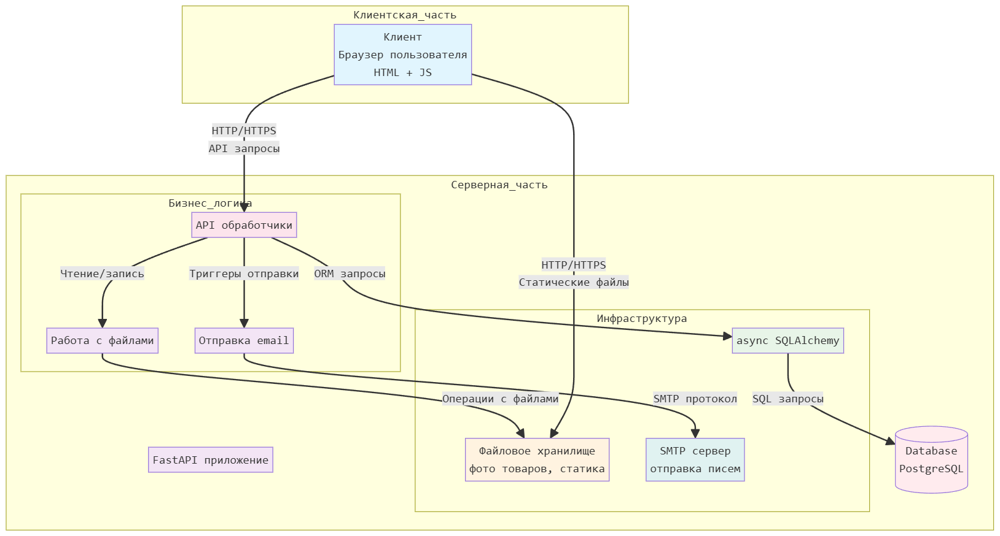

## Project Documentation: Сайт для онлайн-магазина компании, продающей стройматериалы.

## Ссылка на GitHub с разработкой: https://github.com/darya-sheb/OnlineBuildingMaterialsStore

## Разработчики:
1) dev1 - Шебалкова Дарья (darya-sheb)
2) dev2 - Назарова Мария (nazarovamaal-stack)
3) dev3 - Сиротинкина Елизавета (Elizabet0)
4) dev4 - Милешина Мария (glue255)

## Описание проекта

Веб‑приложение интернет‑магазина строительных материалов

## Стек технологий:
* Бэкенд: FastAPI (async) + PostgreSQL (SQLAlchemy)
* Фронтенд: HTML + CSS + JS
* Инфраструктура: Docker, SMTP, CI

## Клиентский интерфейс:

1) Страница регистрации
    * Форма: имя, отчество, фамилия, телефон, email, пароль, подтверждение пароля.
    * Сообщение об ошибке при неверных данных.
2) Страница авторизации
    * Вход по email + пароль.
    * Сообщение об ошибке при неверных данных.
3) Главная / каталог товаров
    * Список товаров: фото, название, производитель, цена, единица измерения, наличие.
    * Кнопка «Добавить в корзину» с выбором количества (проверка остатка).
4) Корзина
   * Список выбранных товаров, количество, цена по позиции, итоговая сумма.
   * Возможность изменить количество / удалить позицию.
   * Кнопка «Оформить заказ».
5) Оформление заказа
   * Введение данных:
       * Почта для подтверждения заказа - по умолчанию вставляется из профиля
       * Контакный телефон - по умолчанию вставляется из профиля
       * Адрес доставки
   * Сообщение об успешном оформлении заказа
   * Письмо на указанный email с номером заказа.
   * В БД количество товара уменьшается.
6) Личный кабинет клиента
   * Просмотр профиля (ФИО, телефон, email).
   * Кнопка "Изменить пароль"
   * Кнопка вернуться в каталог

---

## Задачи:

| Блок задач | Описание задачи                                  | Ответственный  | Планируемое время на выполнение |
|------------|--------------------------------------------------|----------------|---------------------------------|
| 0          | проектирование, документация                     | TL (Даша)      | 1 день                          |
| 1          | инфраструктура                                   | TL (Даша)      | 2 дня                           |
| 2          | пользователи, авторизация                        | dev2 (Маша Н.) | 3-5 дней                        |
| 3          | каталог, корзина и оформление заказа             | dev3 (Лиза)    | 3-5 дней                        |
| 4          | настройка SMTP для рассылки подтверждения заказа | TL (Даша)      | 1 день                          |
| 5          | настройка тестов работы всей системы             | все            | 1-2 дня                         |
| 6          |  документация                                    | TL (Даша)      | 1-2 дня                         | 
| 2-3        | фронтенд                                         | dev4 (Маша М.) | 3-5 дней                        |

 ## Блок 0. Проектирование и документация (TL)
- оформить описание проекта.
- нарисовать диаграмму БД, общую схему взаимодействия системы.
- разбить работу на блоки, оценить задачи, расписать по людям.

## Блок 1. Каркас приложения и инфраструктура : TL
- создать базовый проект FastAPI, структуру `app/`.
- настроить PostgreSQL + SQLAlchemy (async) (создать все модели).
- подготовить `docker-compose.yml` (app + postgres), Dockerfile для приложения.
- настроить базовый CI.

Схема взаимодейтсвия между базами данных:

Схема взаимодействия системы:

## Блок 2. Пользователи и авторизация : dev2 (Маша Н.) + dev4 (Маша М.)
- сделать сервис для шифрования данных с помощью cryptography.fernet
- реализовать регистрацию, валидацию, хэш паролей.
- сделать авторизацию, зависимости.
- реализовать личный кабинет пользователя:
  - просмотр профиля: персональные данные - ФИО, телефон, email
  - изменение пароля
- написать тесты для регистрации/логина/ролей.
- dev4: сверстать формы регистрации/логина, базовый layout (header/footer).

## Блок 3. Каталог, корзина и оформление заказа : dev3 (Лиза) + dev4 (Маша М.)
- реализовать API/сервисы для CRUD по товарам (создать/обновить).
- реализовать API для добавления/удаления товаров в корзину, изменения количества.
- в сервисах реализовать проверку доступного количества товара при добавлении и перед оформлением.
- реализовать оформление заказа:
  - введенный в форму при оформлении заказа email сохраняется в Order.order_email и используется для отправки письма
  - создание заказа;
  - списание остатков товара транзакцией;
  - генерация номера заказа.
- написать тесты для каталога, корзины и оформления заказа (включая проверку остатков).
- dev4: сверстать страницу корзины (список товаров, изменение количества, удаление, итоговая сумма).
- dev4: сверстать страницу подтверждения/оформления заказа (форма введения данных, итоговая информация, страница успеха).

## Блок 4. Email‑уведомления : TL (Даша)
- настроить SMTP через конфиг, сделать сервис отправки писем.
- сделать шаблон письма с подтверждением заказа и номером заказа (HTML‑шаблон).
- встроить отправку письма в процесс оформления заказа (после успешного создания заказа).

Схема поступления запроса на оформление заказа:

## Блок 5. Тесты и качество кода: все
- настроить `pytest`, фикстуры для тестовой БД, базовый TestClient.
- добавить простые тесты для HTML‑маршрутов (status code, наличие ключевых элементов).
- добавить тесты ключевых сценариев (регистрация → вход → добавить в корзину → оформить заказ).
- поднять coverage до ≥ 65%.

## Блок 7. Финальная документация : TL
- собрать достижения команды (кто что сделал, какие блоки закрывал), оформить документ в `final_project` для защиты.
