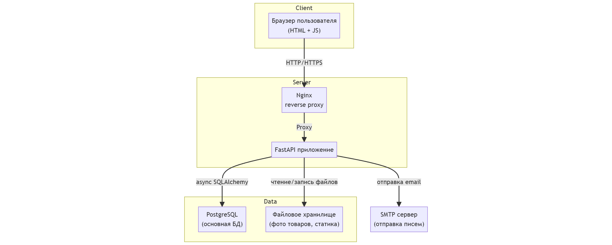
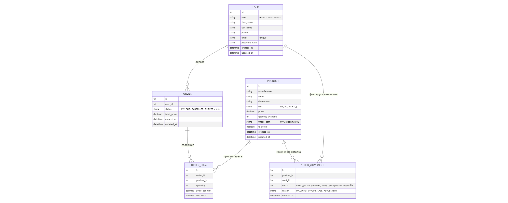
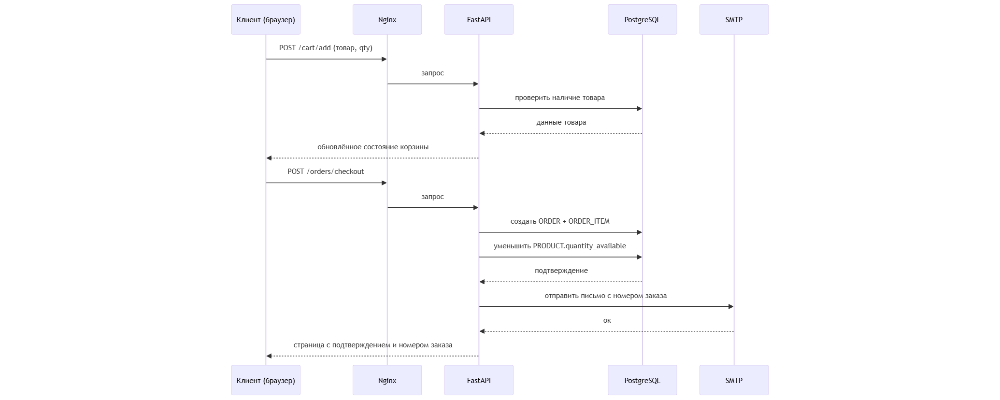

## Project Documentation: Сайт для онлайн-магазина компании, продающей стройматериалы.

## Ссылка на GitHub с разработкой: https://github.com/darya-sheb/OnlineBuildingMaterialsStore

## Разработчики:
1) dev1 - Шебалкова Дарья (darya-sheb)
2) dev2 - Милешина Мария (glue255)
3) dev3 - Назарова Мария (nazarovamaal-stack)
4) dev4 - Сиротинкина Елизавета (Elizabet0)
5) dev5 - Полянская Софья (будет потом)

## Описание проекта

Веб‑приложение интернет‑магазина строительных материалов с авторизацией пользователей двух типов: Клиент (Customer), Работник магазина (Staff)

Стек технологий:

* Бэкенд: FastAPI (async) + PostgreSQL (SQLAlchemy)
* Фронтенд: HTML + CSS + JS
* Инфраструктура: Docker, Nginx, SMTP, CI/CD

## Клиентский интерфейс:

1) Страница регистрации
    * Форма: имя, фамилия, телефон, email, пароль, подтверждение пароля.
    * Сообщение об успешной регистрации / ошибках.
2) Страница авторизации
    * Вход по email + пароль.
    * Сообщение об ошибке при неверных данных.
3) Главная / каталог товаров
    * Список товаров: фото, название, производитель, краткое описание, цена, единица измерения, наличие.
    * Фильтры/поиск по названию/производителю.
    * Кнопка «Добавить в корзину» с выбором количества (проверка остатка).
4) Страница товара (детальная)
   * Фото, характеристики, полное описание.
   * Выбор количества и добавление в корзину.
5) Корзина
   * Список выбранных товаров, количество, цена по позиции, итоговая сумма.
   * Возможность изменить количество / удалить позицию.
   * Кнопка «Оформить заказ».
6) Оформление заказа
   * Подтверждение адреса почты.
7) После оформления:
   * Письмо на email с номером заказа.
   * В БД количество товара уменьшается (бронь/выкуп).
8) Личный кабинет клиента
   * Просмотр профиля (имя, фамилия, телефон, email).
9) История заказов (список заказов, статус, дата, сумма, детали заказа).

## Интерфейс Работника 
(регистрация, авторизация, просмотр каталога и страниц товара аналогично клиентскому)
1) Панель работника / админ‑секция
    * Отдельный раздел (/staff) с доступом по роли.
2) Управление каталогом
    * Страница «Список товаров»: таблица с позициями (название, производитель, остаток, цена).
    * Кнопка «Добавить товар»: форма создания новой позиции с загрузкой фото.
    * Возможность редактировать товар (цена, описание, фото, статус «активен/скрыт»).
3) Управление остатками
    * Интерфейс для изменения количества товара (приход/расход офлайн).
    * Поле «тип операции» (поступление / продажа вживую).
4) История заказов
    * Страница «Все заказы»: таблица с фильтрами по дате/статусу/пользователю.
    * Возможность открыть конкретный заказ и увидеть состав.
    * Возможность найти все заказы конкретного пользователя по email.

---

## Задачи:
 ## Блок 0. Проектирование и документация (TL)

- оформить описание проекта, роли пользователей.
- нарисовать диаграмму БД, общую схему взаимодействия системы.
- разбить работу на блоки, оценить задачи, расписать по людям.

## Блок 1. Каркас приложения и инфраструктура : TL

- создать базовый проект FastAPI, структуру `app/` (api, models, schemas, services и т.д.).
- настроить PostgreSQL + SQLAlchemy (async) + Alembic, написать первую миграцию.
- подготовить `docker-compose.yml` (app + postgres), Dockerfile для приложения.
- настроить Nginx, раздачу статики/картинок.
- настроить базовый CI (линтеры, тесты, сборка docker‑образа).

Схема взаимодействия системы:

## Блок 2. Пользователи и авторизация : dev2 + TL
- сделать модель `User` (id, имя, фамилия, телефон, email, password_hash, роль), миграции.
- реализовать регистрацию (в том числе роль клиента/работника), валидацию, хэш паролей.
- сделать авторизацию, зависимость `current_user`, проверку ролей.
- реализовать личный кабинет пользователя (просмотр/редактирование профиля).
- TL: сверстать формы регистрации/логина, базовый layout (header/footer).

## Блок 3. Каталог товаров и склад : TL + dev3

- сделать модели `Product` (производитель, название, размеры, единица, цена, остаток, image_path, is_active), миграции.
- реализовать API/сервисы для CRUD по товарам (создать/обновить/скрыть/удалить).
- реализовать загрузку и хранение фотографий.
- сделать интерфейс работника для редактирования товара и изменения остатков (формы «+/- количество»).
- TL: сверстать каталог товаров (список, опционально фильтрация).
- TL: сверстать страницу товара (фото, подробности, кнопка «в корзину»).

## Блок 4. Корзина и оформление заказа : TL + dev4

- создать модели `Cart` / `CartItem`, миграции.
- реализовать API для добавления/удаления товаров в корзину, изменения количества.
- в сервисах реализовать проверку доступного количества товара при добавлении и перед оформлением.
- создать модели `Order` / `OrderItem`, миграции.
- реализовать оформление заказа:
  - создание заказа;
  - списание остатков товара транзакцией;
  - генерация номера заказа.
- TL: сверстать страницу корзины (список товаров, изменение количества, удаление, итоговая сумма).
- TL: сверстать страницу подтверждения/оформления заказа (форма контактов, итоговая информация, страница успеха).

Схема взаимодейтсвия между базами данных:

## Блок 5. Интерфейс работника и история заказов : TL + dev4

- реализовать API для получения списка заказов, фильтров по статусу/дате/пользователю.
- реализовать API для получения подробной информации по одному заказу.
- реализовать выборку истории заказов конкретного пользователя (для клиента и для работника).
- TL: сверстать страницу «Мои заказы» в личном кабинете клиента.
- TL: сверстать раздел работника:
  - список всех заказов (таблица, фильтры);
  - просмотр конкретного заказа с позициями и данными пользователя.

## Блок 6. Email‑уведомления : dev4 + dev5

- настроить SMTP через конфиг, сделать сервис отправки писем.
- сделать шаблон письма с подтверждением заказа и номером заказа (HTML‑шаблон).
- встроить отправку письма в процесс оформления заказа (после успешного создания заказа).

Схема поступления запроса на оформление заказа:

## Блок 7. Тесты и качество кода

- dev1 + Dev2: настроить `pytest`, `pytest-asyncio`, фикстуры для тестовой БД, базовый TestClient.
- Dev2: написать тесты для регистрации/логина/ролей.
- Dev3: написать тесты для каталога и операций со складом.
- Dev4: написать тесты для корзины и оформления заказа (включая проверку остатков).
- Dev1: добавить простые тесты для HTML‑маршрутов (status code, наличие ключевых элементов) или e2e‑сценарии.
- dev1: добавить интеграционные тесты ключевых сценариев (регистрация → вход → добавить в корзину → оформить заказ).
- dev1: поднять coverage до ≥ 65%, подключить отчёты в CI.

## Блок 8. Деплой и финальная документация : TL + dev5

- собрать финальный docker‑образ, выложить в dockerhub.
- развернуть приложение в облаке/на виртуалке (Nginx + Docker Compose).
- оформить README с инструкциями по запуску (локальному и в проде).
- собрать достижения команды (кто что сделал, какие блоки закрывал), оформить документ в `final_project` для защиты.

